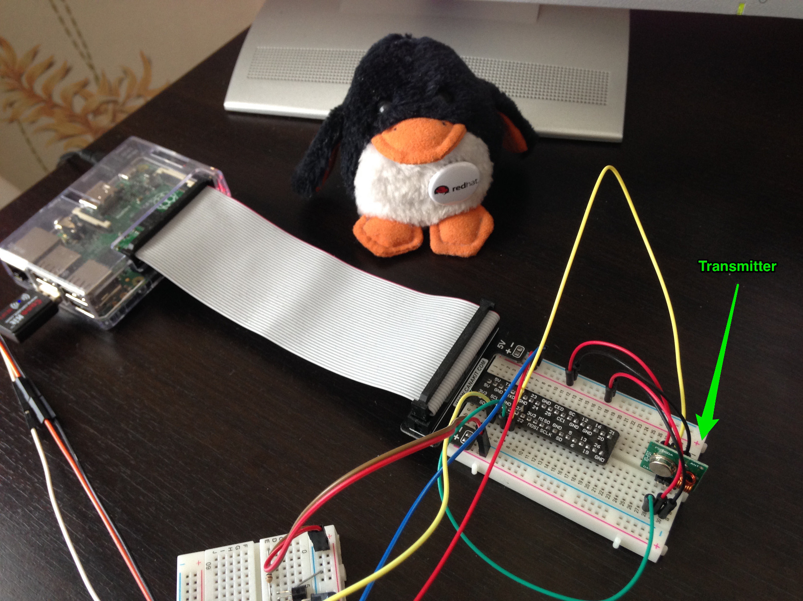
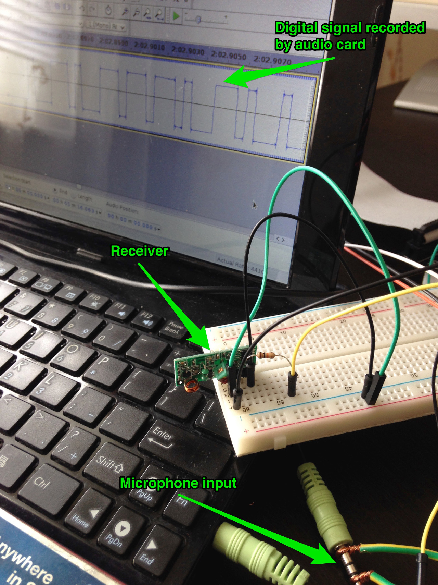

# NoisyNeighbor

## RF Transmitter

Радиопередатчик 433 МГц, подключенный к Raspberry Pi:

## RF Receiver

Радиоприемник 433 МГц, подключенный через резистор в микрофонный вход аудиокарты:

## Signal Generation
На Raspberry Pi компилируем `trisend.cpp`, для сборки нужна библиотека [433Utils](https://github.com/ninjablocks/433Utils). `trisend` посылает tri-state последовательности, которыми кодируются команды rf пультов.

Запускаем скрипт `rf_broadcast.py`, который сначала посылает случайные команды со случайным интервалом между ними. Потом посылает команды вида `FFFFFxxxxxxx`, где `xxxxxxx` -- 7 бит `0` или `1`, представляющих ascii коды флага. После флага опять посылает случайные команды.

## Signal Sniffing
На машине, к которой подключен rf приемник, запускаем [Audacity](http://sourceforge.net/projects/audacity/) и включаем запись с микрофонного входа.
